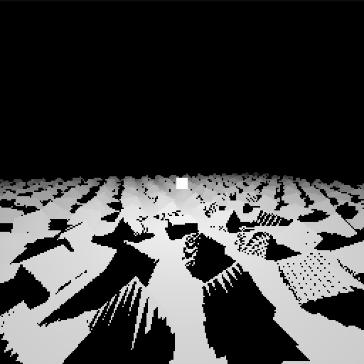

```
ZLight is header only rasterizer.
Its focus is depth, light and shadows.
```

```c
#include "SysHelper.h"
#include "SysWindow.h"
#include "ZLight.h"

Vector3 light = { 0, 1, 0 };

void Draw(Bitmap* bitmap)
{
    ZLightBitmapExtDrawPlane(bitmap);
    ZLightBitmapExtDrawCube(bitmap, light, {}, { 0.2f, 0.2f, 0.2f });

    for (int x = -10; x < 10; x++)
    for (int z = -10; z < 10; z++)
        ZLightBitmapExtDrawCube(bitmap, { (float)x, 0, (float)z }, { (float)x, (float)z, (float)(x+z) }, { 0.5f, 0.5f, 0.5f });
}

int main()
{
    Bitmap* bitmap = ZLightBitmapCreate(256, 256);
    SysWindow* window = SysWindowCreate(1000, 250, 512, 512);
    SysWindowSetFormatBw(window);
    SysWindowShow(window);

    while (SysWindowExists(window))
    {
        float time = (float)SysHelperGetTime() / 2000;
        ZLightBitmapReset(bitmap);
        ZLightBitmapSetViewByTarget(bitmap, { sinf(time)*2, sin(time)+2, cosf(time)*4 }, light, { 0, 1, 0 });
        Draw(bitmap);
        ZLightLightRemove();
        ZLightLightAdd(light, 1);
        ZLightLightUpdate(Draw);
        ZLightLightApply(bitmap);
        SysWindowSetPixelsAutoScaleBw1(window, (uint32_t*)bitmap->buffer, bitmap->width, bitmap->height);
        SysWindowUpdate(window);
        SysHelperHaltLoop(20);
    }

    return 0;
}
```
```
How to run

Windows
Depends on MinGW version x86_64-12.2.0-release-posix-seh-ucrt-rt_v10-rev2
MSVC is not suported, but should work
How to build and run?
cd tests/LevelFinal
build
run

Linux
Depends on GCC
How to build and run?
cd tests/LevelFinal
bash build.bash
bash run.bash
```
